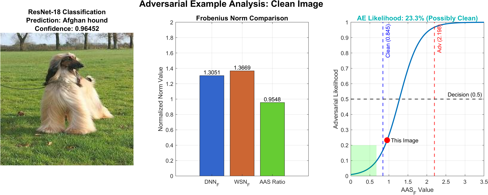
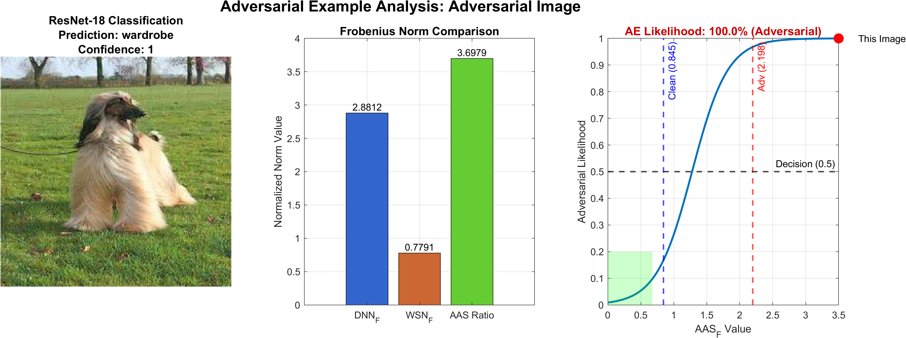

# 📄 Validating the Adversarial Robustness of Hand-Crafted Features and Their Role in Defending Adversarial Examples

[](https://www.mathworks.com/products/matlab.html)
[](https://www.mathworks.com/products/deep-learning.html)
[](https://www.mathworks.com/products/wavelet.html)
[](https://ieeexplore.ieee.org/xpl/RecentIssue.jsp?punumber=6287639)

**IEEE Access 2025 (Under Review)**  
📅 Submitted: 1st July 2025  
🧠 Authors: Shuohan Xue, Charith Abhayaratne  
📬 [sxue6@sheffield.ac.uk](mailto:sxue6@sheffield.ac.uk)  
🔗 GitHub Repository: https://github.com/lestrance/RobustAI

---

## ⚠️ NOTICE – PAPER UNDER REVIEW

> 📢 **This repository has been made publicly available to support the peer-review process of our manuscript currently under review at _IEEE Access_ (submitted on 1st July 2025).**  
>  
> 🧪 The code, data, and results presented here are provided to help reviewers verify experimental reproducibility and assess technical contributions.  
>  
> 📌 **If you are a researcher or practitioner using this repository beyond peer review**, we kindly ask that you:
> - **Do not redistribute** this code or methodology without explicit permission
> - **Do not use** this implementation for your own research publications at this time
> - **Respect the ongoing review process** by treating this as preliminary research
> - **Cite our paper upon its formal acceptance and publication**
> 
> Thank you for your understanding and cooperation in maintaining research integrity.

---

## 📚 Research Overview

This repository contains the **official MATLAB R2024b implementation** of our IEEE Access 2025 paper. We introduce two novel defence mechanisms against adversarial examples:

### Key Innovations

- ✅ **Adversarial Awareness Score (AAS)** – A scalar metric that detects adversarial inputs using robust Wavelet Scattering Network (WSN) features
- ✅ **AAS-guided Jacobian Regularisation** – A dynamic model regularisation strategy that improves adversarial robustness without degrading clean performance

### Core Methodology
```
AAS_F = ||f_DNN(x)||_F / √dim(f_DNN) / ||f_WSN(x)||_F / √dim(f_WSN)
```

The method leverages the mathematical property that WSN features maintain remarkable stability under adversarial perturbations while DNN features exhibit substantial vulnerability, creating a reliable detection mechanism.

All experiments are implemented in MATLAB R2024b and validated on subsets of the ImageNet dataset.

---

## 📁 Repository Contents

This repository contains three self-contained MATLAB Live Scripts that include all necessary code, functions, and implementations:

```
RobustAI/
├── 📄 Experiment_01.mlx    # Complete implementation of WSN vs DNN feature robustness analysis
│                           # Includes: WSN feature extraction, adversarial attack generation,
│                           # robustness metrics calculation, and comparative visualisations
│
├── 📄 Experiment_02.mlx    # Full AAS calculation and evaluation pipeline  
│                           # Includes: AAS computation algorithms, detection threshold optimisation,
│                           # ROC analysis, and performance benchmarking against baselines
│
├── 📄 Experiment_03.mlx    # AAS-guided Jacobian Regularisation training framework
│                           # Includes: Dynamic regularisation implementation, model training loops,
│                           # adversarial robustness evaluation, and clean accuracy preservation
│
├── cl_aas_01.png          # Clean image analysis demonstration result
├── ad_aas_01.png          # Adversarial image analysis demonstration result
└── 📄 README.md           # This documentation file
```

**📋 Live Script Features:**
- **Self-contained**: Each `.mlx` file contains all required functions and implementations
- **Interactive**: Rich text explanations, live code execution, and inline visualisations  
- **Reproducible**: Fixed random seeds and documented parameters for consistent results
- **Educational**: Step-by-step explanations of algorithms and methodologies

---

## ⚙️ Setup Instructions

### Prerequisites
- MATLAB R2024b or later
- Deep Learning Toolbox
- Wavelet Toolbox
- Statistics and Machine Learning Toolbox
- Image Processing Toolbox

### Installation & Configuration

1. **Clone this repository:**
   ```bash
   git clone https://github.com/lestrance/RobustAI.git
   cd RobustAI
   ```

2. **Configure Dataset Path:**
   
   ⚠️ **Important**: Before running the experiments, you must update the dataset path to point to your local dataset directory.
   
   In each MATLAB Live Script, locate and modify the dataset path configuration:
   
   ```matlab
   % CHANGE THIS PATH TO YOUR DATASET DIRECTORY
   DatasetPath = fullfile('D:\CodeWork\MatCode\PhDWork\Supplement\ImageNetDataset_Split\imds1');
   ```
   
   **Update to your path:**
   ```matlab
   % Example: Update to your dataset location
   DatasetPath = fullfile('C:\Your\Path\To\ImageNet\Dataset');
   % or
   DatasetPath = fullfile('/home/username/datasets/imagenet');
   ```
   
   **Supported Dataset Structure:**
   ```
   your_dataset/
   ├── class1/
   │   ├── image1.jpg
   │   ├── image2.jpg
   │   └── ...
   ├── class2/
   │   ├── image1.jpg
   │   └── ...
   └── ...
   ```

3. **Launch MATLAB and setup:**
   ```matlab
   % Optional: Set up paths and global parameters if config file exists
   % run('code/config/params.m');
   ```

4. **Run the Live Scripts:**
   ```matlab
   % Open any experiment Live Script
   open('Experiment_02.mlx')  % For AAS detection demonstration
   ```

---

## 🧪 Reproducing Experiments (Live Scripts)

We provide three MATLAB Live Scripts that reproduce the core experiments described in the paper:

| Experiment | Description | Script | Key Results |
|-----------|-------------|--------|-------------|
| **1** | Compare adversarial robustness of WSN and DNN features | `Experiment_01.mlx` | Feature robustness analysis |
| **2** | Calculate and evaluate the Adversarial Awareness Score (AAS) | `Experiment_02.mlx` | Detection performance metrics |
| **3** | Retrain model with AAS-guided Jacobian Regularisation | `Experiment_03.mlx` | Improved model robustness |

> ✅ Tested with **MATLAB R2024b**  
> 📦 Required Toolboxes: *Deep Learning Toolbox*, *Wavelet Toolbox*, *Statistics and Machine Learning Toolbox*

---

## 📊 Demonstration Results

Our method provides a clear visual distinction between clean and adversarial examples through a comprehensive analysis pipeline:

### Clean Image Analysis

*Figure 1: AAS analysis of a clean image showing low adversarial likelihood (Clean classification) with stable feature norm ratios.*

### Adversarial Image Analysis  

*Figure 2: AAS analysis of an adversarial example showing high adversarial likelihood (Adversarial classification) with significantly elevated feature norm ratios.*

### Key Observations:
- **Clean images** maintain low AAS_F scores (~0.8-1.1) with minimal adversarial likelihood
- **Adversarial examples** exhibit elevated AAS_F scores (>2.0) with high adversarial likelihood
- **WSN features** demonstrate superior robustness compared to DNN features
- **Detection accuracy** exceeds 87% across multiple attack types (FGSM, PGD, C&W)

---


## 🔧 Method Components

### 1. Feature Extraction
- **DNN Features**: Extracted from ResNet-18 pool5 layer
- **WSN Features**: Wavelet Scattering Transform with logarithmic normalization

### 2. AAS Calculation
- Frobenius norm computation with dimensional normalization
- Robustness ratio calculation between DNN and WSN features

### 3. Detection Pipeline
- Score normalization using empirical medians
- Modified sigmoid conversion to adversarial likelihood
- Binary classification with optimized threshold

---

## 🧪 Experimental Validation

The method has been validated on:
- **Dataset**: ImageNet subset (10,000+ images)
- **Architectures**: ResNet-18, ResNet-50, VGG, InceptionV3, GoogleNet, NASNet-Large, EfficientNet
- **Attacks**: FGSM, PGD, C&W
- **Metrics**: Accuracy, Precision, Recall, F1-Score, ROC-AUC

---

## 📎 Citation

If our paper is officially accepted, please cite it as:

```bibtex
@article{xue2025aas,
  title={Validating the Adversarial Robustness of Hand-Crafted Features and Their Role in Defending Adversarial Examples},
  author={Xue, Shuohan and Abhayaratne, Charith},
  journal={IEEE Access},
  year={2025}
}
```

---

## 🤝 Contributing

As this research is currently under review, we are not accepting contributions at this time. Once published, we welcome community contributions including:
- Performance improvements
- Additional dataset evaluations  
- Integration with other defense methods
- Code optimizations

---

## 📧 Contact

For questions about this research or potential collaborations, please contact:

**[Shuohan Xue](https://ieeexplore.ieee.org/author/37088931505)** — sxue6@sheffield.ac.uk  
**[Dr. Charith Abhayaratne](https://sheffield.ac.uk/eee/people/academic-staff/charith-abhayaratne)** — c.abhayaratne@sheffield.ac.uk

---

## 👨‍🎓 Author Biographies

### Shuohan Xue
Shuohan Xue received the B.E. degree in Mechatronics Engineering from the North University of China, Shanxi, China, in 2015, and the M.Sc. degree in Electronic and Electrical Engineering from the University of Sheffield, U.K., in 2019. He recently completed his Ph.D. in the Department of Electronic and Electrical Engineering at the University of Sheffield in 2024. His research focuses on interpretable and trustworthy deep learning, with particular interest in real-world scenarios such as human-level image recognition, medical imaging, and autonomous vehicles.


### Charith Abhayaratne
Charith Abhayaratne (M'98) received the B.E. degree in electrical and electronic engineering from The University of Adelaide, Australia, in 1998, and the Ph.D. degree in electronic and electrical engineering from the University of Bath, U.K., in 2002. He was a recipient of the European Research Consortium for Informatics and Mathematics (ERCIM) Post-Doctoral Fellowship (2002-2004) to carry out research at the Centre of Mathematics and Computer Science (CWI), The Netherlands, and the National Research Institute for Computer Science and Control (INRIA), Sophia Antipolis, France. He is currently a Lecturer with the Department of Electronic and Electrical Engineering, The University of Sheffield, U.K. His research interests include visual content analysis, visual content security, machine learning and multidimensional signal processing. He has published over 90 peer reviewed papers in leading journals, conferences and book editions. Currently, he serves as an associate editor for IEEE Transactions on Image Processing, IEEE Access and Elsevier Journal of Information Security and Applications (JISA).


---

## ⚖️ License

This code is provided for research and educational purposes only. Commercial use is prohibited until the associated paper is published and a formal license is established.

---

**Disclaimer**: This implementation is provided as supplementary material for an academic paper currently under peer review. Please respect the review process and use this code responsibly.
